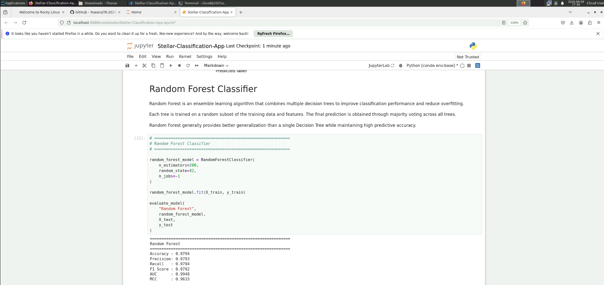
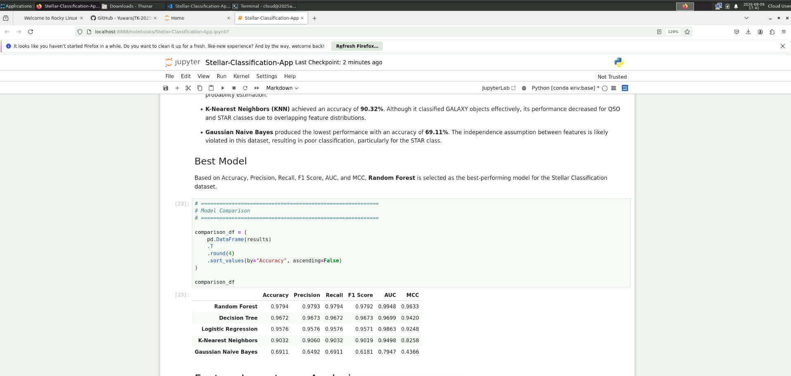
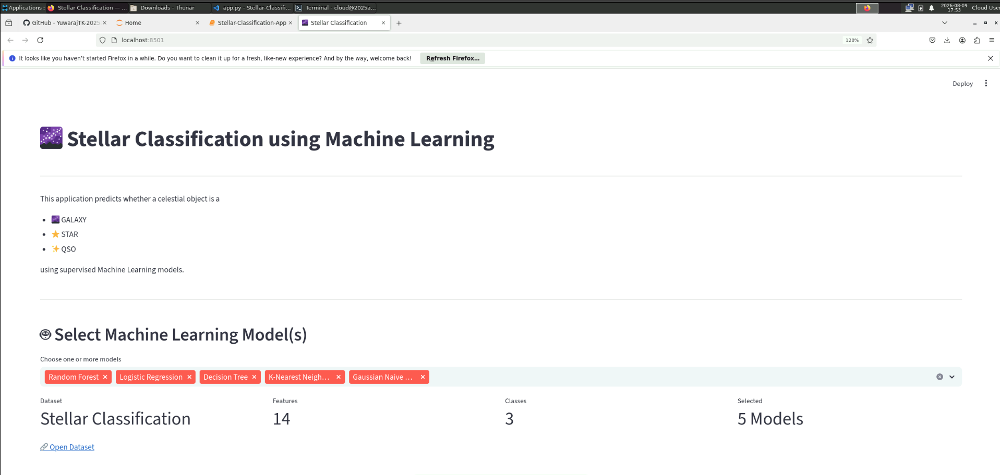
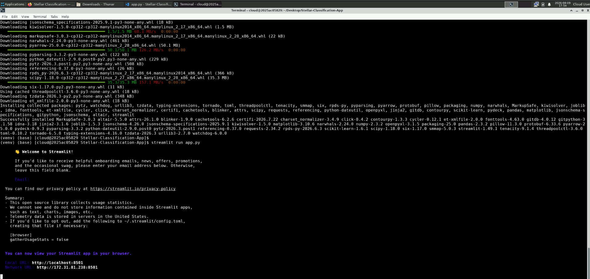
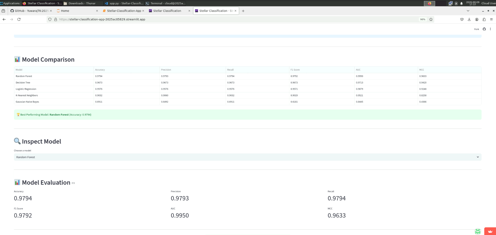

# 🌌 Stellar Classification using Machine Learning

---

# A. Problem Statement

The objective of this project is to develop a **Multi-Class Classification** model that can accurately classify celestial objects into one of the following categories:

- 🌌 Galaxy
- ⭐ Star
- ✨ Quasi-Stellar Object (QSO)

The project utilizes the **SDSS Stellar Classification Dataset** and compares the performance of five supervised machine learning algorithms:

- Logistic Regression
- Decision Tree
- K-Nearest Neighbors (KNN)
- Gaussian Naive Bayes
- Random Forest (Ensemble)


---

# B. Dataset Description

**Dataset Name:** SDSS Stellar Classification Dataset

**Dataset Source:**

https://www.kaggle.com/datasets/fedesoriano/stellar-classification-dataset-sdss17

## Dataset Summary

| Property | Value |
|----------|-------|
| Problem Type | Multi-Class Classification |
| Number of Samples | 100,000 |
| Number of Features | 14 |
| Target Classes | 3 |
| Target Variable | class |

## Input Features

## Input Features

| No | Feature | Description |
|----|---------|-------------|
| 1 | **alpha** | Right Ascension (RA) angle of the celestial object measured at the J2000 epoch. It represents the object's angular position in the sky, similar to longitude on Earth. |
| 2 | **delta** | Declination (DEC) angle of the celestial object measured at the J2000 epoch. It represents the object's angular position in the sky, similar to latitude on Earth. |
| 3 | **u** | Brightness (magnitude) measured through the Ultraviolet (U) photometric filter. |
| 4 | **g** | Brightness (magnitude) measured through the Green (G) photometric filter. |
| 5 | **r** | Brightness (magnitude) measured through the Red (R) photometric filter. |
| 6 | **i** | Brightness (magnitude) measured through the Near-Infrared (I) photometric filter. |
| 7 | **z** | Brightness (magnitude) measured through the Infrared (Z) photometric filter. |
| 8 | **run_ID** | Identifier of the SDSS observation run in which the celestial object was captured. |
| 9 | **cam_col** | Camera column number that identifies the specific camera sensor used during the sky survey. |
| 10 | **field_ID** | Identifier of the observed field within an SDSS imaging run. |
| 11 | **redshift** | Redshift value indicating how much the wavelength of the object's light has shifted due to the expansion of the universe. It is an important feature for distinguishing galaxies, stars, and quasars. |
| 12 | **plate** | Spectroscopic plate identifier used during the SDSS spectroscopic observation. |
| 13 | **MJD** | Modified Julian Date representing the date and time when the observation was recorded. |
| 14 | **fiber_ID** | Identifier of the optical fiber used to collect light from the celestial object during spectroscopic observation. |

## Target Classes

- GALAXY
- STAR
- QSO

---

# C. GitHub Repository Link

GitHub Repository:

https://github.com/YuwarajTK-2025ac05829/Stellar-Classification-App

> Replace the above URL with your actual GitHub repository link before submission.

---

# D. Model Comparison

| ML Model | Accuracy | AUC | Precision | Recall | F1 Score | MCC |
|----------|----------|------|-----------|--------|----------|------|
| Logistic Regression | 0.9576 | 0.9863 | 0.9576 | 0.9576 | 0.9571 | 0.9248 |
| Decision Tree | 0.9673 | 0.9699 | 0.9673 | 0.9673 | 0.9673 | 0.9420 |
| K-Nearest Neighbors | 0.9032 | 0.9498 | 0.9060 | 0.9032 | 0.9019 | 0.8258 |
| Gaussian Naive Bayes | 0.6911 | 0.7947 | 0.6492 | 0.6911 | 0.6181 | 0.4366 |
| Random Forest (Ensemble) | **0.9794** | **0.9948** | **0.9793** | **0.9794** | **0.9792** | **0.9633** |

---

# E. Model Performance Observations

| ML Model | Observation about Model Performance |
|----------|-------------------------------------|
| **Logistic Regression** | Logistic Regression achieved an accuracy of **95.76%** and provided a strong baseline for the classification task. It produced balanced predictions across all three classes with high precision, recall, and F1-score. |
| **Decision Tree** | Decision Tree improved the overall accuracy to **96.73%** by effectively learning non-linear decision boundaries. It demonstrated better performance than Logistic Regression but may be more susceptible to overfitting. |
| **K-Nearest Neighbors (KNN)** | KNN achieved an accuracy of **90.32%**. Although its performance was satisfactory, it was lower than Decision Tree and Random Forest because of its sensitivity to feature scaling and neighboring sample distribution. |
| **Gaussian Naive Bayes** | Gaussian Naive Bayes produced the lowest performance with an accuracy of **69.11%**. The model struggled to classify the QSO class accurately because the independence assumption among features was not well suited for this dataset. |
| **Random Forest (Ensemble)** | Random Forest achieved the highest performance among all evaluated models. It obtained an accuracy of **97.94%**, an AUC of **0.9948**, and the highest Precision, Recall, F1-score, and MCC, demonstrating excellent generalization capability. |
| **Overall Winner for the Dataset** | **Random Forest (Ensemble)** was selected as the final model because it achieved the best performance across all evaluation metrics. It provided the highest classification accuracy and the most robust predictions, making it the most suitable model for deployment in the Streamlit application. |

---

# Project Structure

```
Stellar-Classification-App/
│
├── app.py
├── README.md
├── requirements.txt
├── test_data.csv
│
├── dataset/
│   └── star_classification.csv
│
├── models/
│   ├── logistic_regression.pkl
│   ├── decision_tree.pkl
│   ├── knn.pkl
│   ├── gaussian_nb.pkl
│   ├── random_forest.pkl
│   ├── scaler.pkl
│   ├── label_encoder.pkl
│   └── Stellar-Classification-App.ipynb
│
├── components/
│   ├── __init__.py
│   ├── classification_report.py
│   ├── confusion_matrix.py
│   ├── dashboard.py
│   ├── dataset_preview.py
│   ├── download.py
│   ├── feature_importance.py
│   ├── metrics.py
│   ├── model_comparison.py
│   ├── model_inspector.py
│   ├── model_selection.py
│   ├── prediction.py
│   └── prediction_mode.py
│
└── utils/
    ├── __init__.py
    ├── evaluation.py
    └── model_loader.py
```

---

# How to Run the Project

## 1. Clone the Repository

```bash
git clone https://github.com/YuwarajTK-2025ac05829/Stellar-Classification-App.git
```

## 2. Navigate to the Project Folder

```bash
cd Stellar-Classification-using-Machine-Learning
```

## 3. Install the Required Packages

```bash
pip install -r requirements.txt
```

## 4. Launch the Streamlit Application

```bash
streamlit run app.py
```

---

# Technologies Used

- Python
- Pandas
- NumPy
- Scikit-learn
- Matplotlib
- Streamlit
- Joblib

---

# Author

**Name:** Yuwaraj T K

**BITS ID:** 2025AC05829

**Email:** 2025ac05829@wilp.bits-pilani.ac.in

**Programme:** M.Tech Artificial Intelligence & Machine Learning

**University:** BITS Pilani – Work Integrated Learning Programme


# Application Screenshots

## 1. Model Prediction in ipynb 


## 2. Best Model


## 3. Localhost Streamlit app


## 4. Streamlit app Running in terminal


## 5. Hosted Streamlit app
